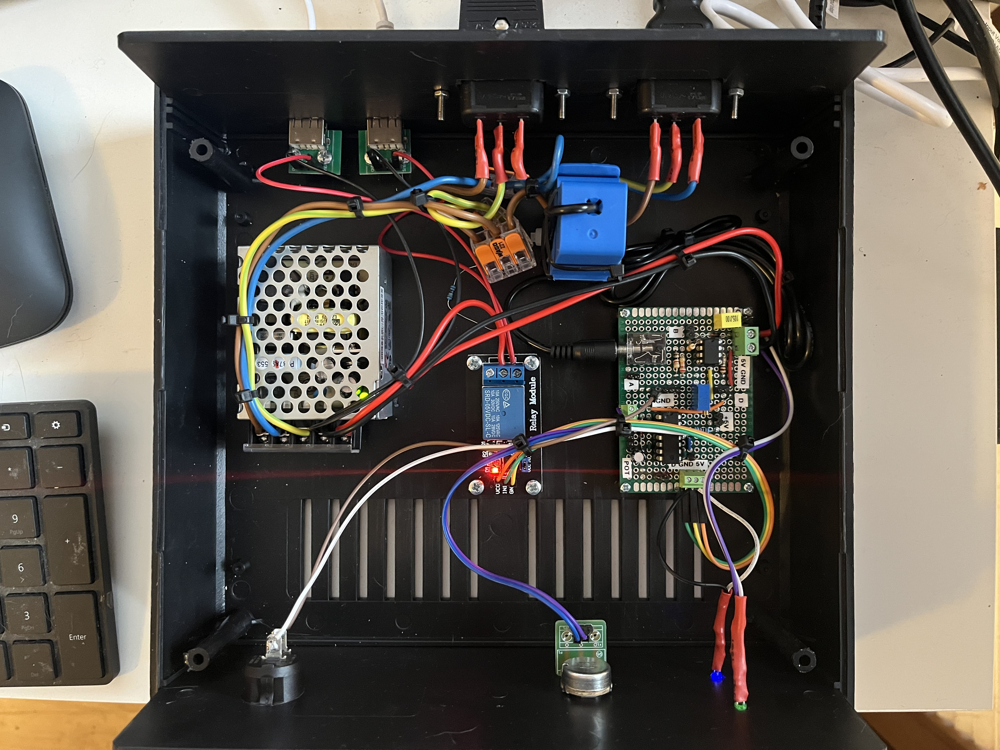

# Radioshack digital clock controller

 

## Purpose of the project

This project addresses a practical need: controlling the power supply to radio shack real-time clocks based on the status of a PC monitor. The goal is to synchronize the clocks' power state with the monitor, ensuring they turn on and off appropriately.

To prevent the clocks from turning off during brief monitor blackouts—such as dark scenes, temporary disconnections, or sleep mode—a delay timer has been integrated. This timer allows for short interruptions to be ignored, ensuring consistent and reliable operation.

## Design challanges

Initially, the focus was on detecting the monitor's state through software, which could then control the hardware powering the clocks. However, it quickly became evident that reliably detecting the monitor's status—especially on Windows—was challenging, if not impossible. Despite numerous online discussions addressing this issue, all examined implementations proved unreliable.

The focus then shifted to the HDMI interface, exploring the possibility of building a hardware status detector using signals from the HDMI bus. Unfortunately, this idea had to be abandoned primarily due to the High-bandwidth Digital Content Protection (HDCP) mechanism. HDCP makes it extremely difficult to intercept or manipulate HDMI signals.

The chosen solution employs an AC current sensor to monitor the PC monitor's power consumption. An increase in power usage is associated with the monitor transitioning to an active state. This approach is implemented entirely in hardware, ensuring simplicity and reliability.

## Operation description

The circuit diagram for the proposed controller is shown below:

 

The general method for attaching the SCT-013-005 AC current sensor to the power line is illustrated below (courtesy of Murky Robot):

 

Due to the switching power supply of the PC monitor, the output signal Ua from the AC current sensor (SCT-013-005) consists of pulses with an amplitude of approximately ±100 mV and a frequency of 50 Hz. 

Before reaching the D1/C1 rectifier, the signal from the current sensor is amplified by the op-amp U2A (LM358) configured as a non-inverting amplifier, the gain of this stage is determined by resistors R3 and R4. With R3 = 38 kΩ and R4 = 1 kΩ, the gain is calculated as:

$G = 1 + \frac{R3}{R2} = 1 + \frac{38k}{1k} = 39$

The gain level of U2A is selected to produce output voltage well above forward diode D1 drop voltage of about 0.6V. In our case the amplitude of U2A output voltage Ub is:

$Ub = G * Ua = 39 * 0.1V = 3.9V$

Signals Ua and Ub are shown on the picture below (Ua - blue curve, Ub - yellow curve):

 

Resistor R1 is included to prevent the output voltage of U2A from spiking to its maximum value when the current sensor is disconnected. When the sensor is connected, its internal resistor pulls the op-amp’s non-inverting input to ground. Without R1, disconnecting the sensor would leave the op-amp’s non-inverting input floating.

R1 should be significantly larger than the internal reference resistor of the current sensor to avoid affecting the sensor's output voltage.

DC voltage Uc from the rectifier is compared to the reference voltage using op-amp U2B, configured as an inverting comparator.

Signal Uc (yellow curve) and coresponding signal Ub (blue curve) can be seen below:

 

The reference voltage is set to approximately 1V using the RV1 potentiometer. This value can be reduced if the output voltage amplitude from the current sensor is significantly lower than 100 mV.

When the PC monitor is active, the DC voltage at the rectifier output exceeds 3.6V. Since this is greater than the 1V reference voltage, the output of comparator U2B is driven close to 0V (TTL low state).

When the PC monitor is disconnected or in sleep mode, the DC voltage at the rectifier output is driven close to 0V. Since this is lower than the 1V reference voltage, the output of comparator U2B is driven close to Ucc (TTL high state).

Resistor R1 is added to allow capacitor C1 to discharge when the PC monitor transitions from an active state to a disconnected state, i.e. without R1, the rectifier output voltage would remain high even after the PC monitor enters sleep mode or is disconnected.

The signal from the comparator U2B is inverted by the Schmitt trigger NAND gate U3A (4093), generating voltage Ue. This signal then controls an RC circuit that introduces a delay adjustable from 0 to 6 seconds, set by potentiometer RV2. Diode D2 allows for the immediate discharge of capacitor C2 whenever the output of U3A goes low, ensuring no delay in turning off the clock power when the monitor is disconnected or enters sleep mode, producing voltage Uf.

The behavior of voltages Ue (blue curve) and Uf (yellow curve) is illustrated in an equivalent RC circuit (R=100kΩ, C=10μF) for cases with and without diode D2. In the scenario depicted below, a square wave is applied as Uf.

Scenario when diode D2 is not used:

 

Scenario when diode D2 is part of the circuit:

 

The output voltage from the RC circuit is inverted by NAND gate U3B and, together with the signal from the switch SW2, drives NAND gates U3C and U3D. These gates control the relay circuit, which is activated by a TTL low state.

Switch SW2, when turned on, permanently activates the relay circuit, ensuring the clocks remain powered on regardless of the PC monitor’s state. When SW2 is off, the clocks are powered on only when the monitor is active.

LED1 (green) indicates the device is connected to the AC power line.
LED2 (blue) lights up when the relay is activated, signifying that the clock modules are powered on.

## Practical implementation

Below are a few pictures showcasing the practical implementation of the radioshack digital clock controller:

 

# References

[1] [Split core current transformer SCT013-005 datasheet](<https://qrp-labs.com/qcx/rfpower.html>)

[2] [Is It OK to Use an External 50 Ohm Terminator with an Oscilloscope?](<https://blog.teledynelecroy.com/2022/06/is-it-ok-to-use-external-50-ohm.html>)